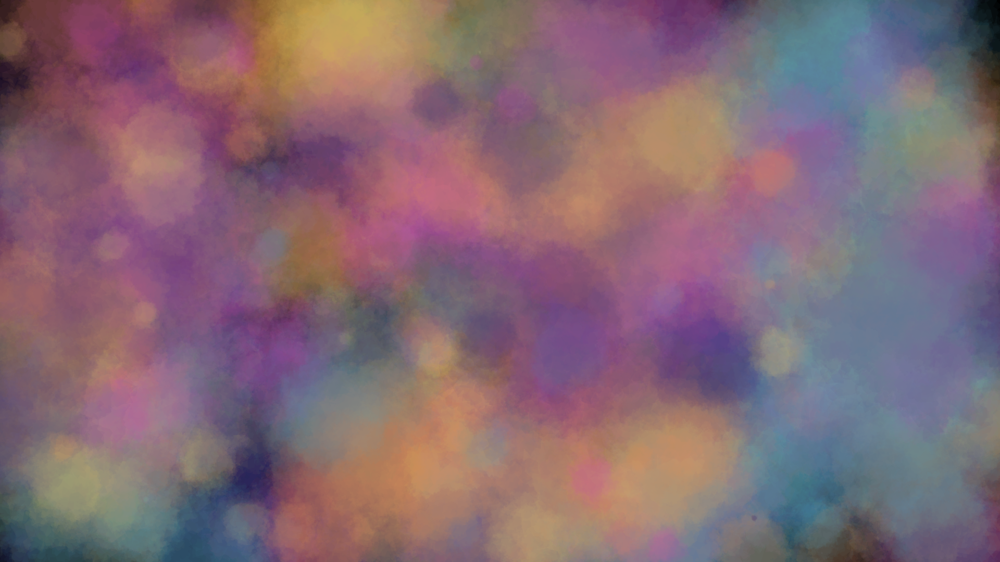
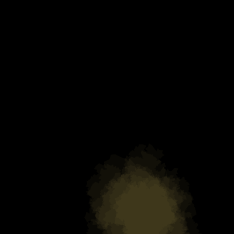

# My images

# first example

- **commit**: `6d4a12892f8f9dda56474ec41602914f578e3721`
- **seed**: `1633043671972`
- **Description**:

    Fis example of Perlin noise after implement my own algorithm for it. 

# wallpaper

- **commit**: `023306c4e70bc8f885aa416abff0388597280b15`
- **seed**: `1633117805968`
- **Description**:

    Cool effect playing with colors.

# Colors to my canvas

- **commit**: `54978af27b87c2289f64dbae5390cc4d01fec1f6`
- **seed**: `1341416177755`
- **Description**:

    Playing around with gif animations.

